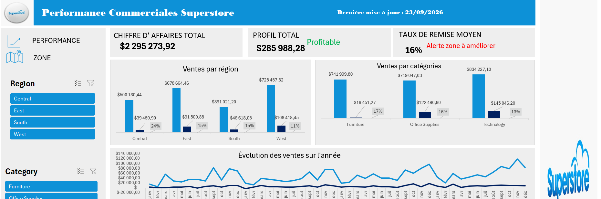

# Dashboard Interactif - Perfomances des ventes & Marges (Superstore)

## Context & Problématique métier

Une entreprise (_Superstore_) souhaite suivre les performances des ventes par région
et catégorie pour identifier les zones à améliorer.

---
# Objectif

Créer un tableau de bord interactif pour analyser les KPI clés tels que
les ventes, les marges, et les performances régionales.

---

## Aperçu & Demo du Dasnboard

! [Dashboard Excel](Images/dashboard-superstore.PNG)

Want to see the dahboard in action ?

**Watch the interactive demo**

## 

---

## Données

## Dans ce projet on utilise le **Superstore Dataset**, contenant des données relatives aux commandes, produits, catégories, régions, ventes et marges.

### les principaux indicateurs clés de performance (KPI)

* **Indicateurs de Performance (KPI) : **
  - **Chiffre d'affaires global** (\$)
  - **Profit total / Marge brute** (/$)
  - **Taux de remise moyen** (%)

* **Analyse Croisée :** Évaluer l'impact des remises accordées sur la rentablité par Région (_Central, East, South, West_), par Catégories (_Furniture, Office Supplies, Technology_), et par Sous-Catégories(_Art
  , Appliances, Accessories, Binders, Bookcases, Chairs, Furnishings, Envelopes, Fasteners, Copiers, Labels, Tables, Storage, Phones, Paper, Supplies, Machines
  _)
* **Alertes Visuelles Dynamiques :** Mise en forme des couleurs dynamique (Passage au **Rouge** si Remise > 15 % ou si < 0 et au **Vert** si Remise < 15 % ou si Profit > 0).

---

## Fonctionnalités & Techniques Excel Utilsées

* **Nettoyage & Structuration des données :** Ingestion et vérification du dataset `Superstore.csv` (9994+ lignes).
* **Formules & Logique Métier :** Utilisation de `SOMME.SI`, `SOMME`, `MOYENNE`, `INDEX/EQUIV`, et formules conditionnelles imbriquées (`SI`).
* **Tableaux Croisés Dynamiques (TCD) :** Centralisation des calculs et agrégations dans un onglet dédié `Data`.
* **Interactivité :** Connexion de **Segments dynamiques (Slicers)** (_Région_, _Catégorie_, _Sous-Catégories_) reliés à l'ensemble des graphiques et cartes KPI.
* **UI/UX Dashboard :** Design épuré, cartes KPI avec alertes couleur dynamiques.

## Résultat Clés & Ma récommadations Métier

1. ** Alerte Remises (Région Central) :**

* **Constat :** La région *Central* enregistre un taux de remise moyen de **24% %**, détruisant la rentabilité brute.
* **Action :** Plafonner immédiatement les remises à un maximun de **15 %** sur cette zone.

2. ** Sous-performance produit (Catégorie Furniture) :**

* **Constat :** La sous-catégorie *Tables* génère un volume important de ventes mais enregistre des pertes nettes dues aux rabais excessifs.
* **Action :** On doit réviser la politique tarifaire de la sous-catégorie *Tables* pour supprimer les ventes à perte.

** Ma recommadation stratégique :**

* **Action : ** Se concentrer les investissements marketing sur la région *West*, qui enregistre le meilleur ratio que sa soit sur le volume/marge.

---

## Compétences développées

- Préparation et organisation des données
- Analyse des performances commerciales
- Construction de KPI
- Analyse multidimentionnelle avec les tableaux dynamiques
- Création de dashboards interactifs avec Excel
- Datavisualisation

--- 

## Structure du dépot

|-- Dataset/
|__ Sample - Superstore.csv  
|---Images/
|___Dashboard-superstore-PNG
|___Dashboard-Superstore.xlsx
|
|__README.md
|
|__.gitignore

## C'est un projet réalisé dans le cadre de mon portfolio Data Analyst

Ce projet fait partie de mes projets personnels visant à développer mes compétences en analyse de données et Business Intelligence.

# À propos de moi

Je m'appelle **Mariame Souaré**, je suis une **analyste de données** en devenir, passionnée par la transformation des données brutes en informations exploitables.

Je perfectionne sans cesse mes compétences grâce à des projets concrets sur **Excel, SQL, Power BI, Python, R et SAS**.

**Email:** swaray.kmariame@gmail.com

**LinkedIn:** https://www.linkedin.com/in/mariame-souare/

**Portfolio:** https://souaremaria.github.io/
